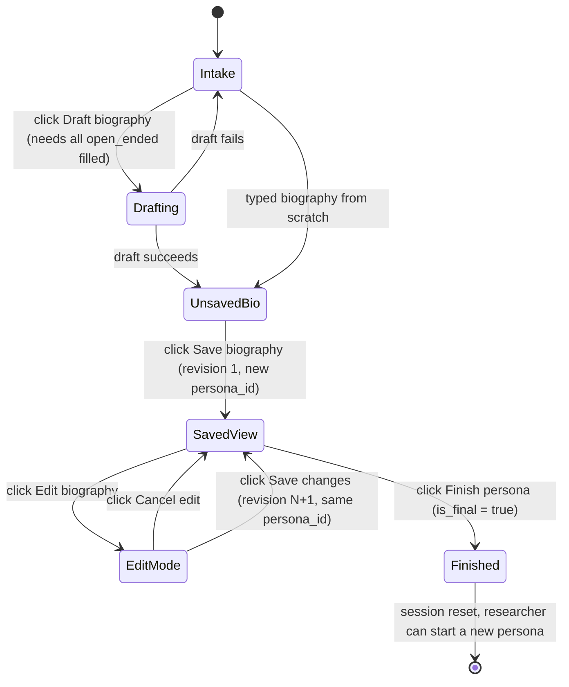

# Persona lifecycle redesign

This doc captures the full set of changes that turn the app from a "one
biography row per click" workflow into a versioned **persona** workflow
where a single persona is worked on until the researcher explicitly
finalizes it. Every edit the researcher makes to the biography is
persisted as a new revision row under the same persona key.

## Motivation (user requirements, verbatim)

1. The `open_ended` intake questions must be filled (manually or via an
   LLM-generated answer).
2. Once a biography is generated it has to be saved; only after the
   first version is saved does an **Edit** button appear for further
   researcher changes.
3. After each biography change, when the researcher runs a simulation
   (chat / questionnaire), the changed biography must be saved.
4. The researcher works on the same persona until they press a
   **Finish** button — at which point they can start a new persona.
5. All researcher edits are saved in the DB.
6. The same persona with biography changes must be grouped under a
   single key in the DB.

Decisions taken on points that were ambiguous:

- **Revision trigger**: an explicit "Save changes" button. Chat and
  questionnaire always run against the most recently saved revision;
  unsaved edits are held in the text area but not sent to the LLM or
  stored. (User picked `explicit_save`.)
- **Open-ended validation**: two ways to satisfy it — researcher types
  the answer, or clicks **Randomize**, which now uses the selected LLM
  to generate short plausible answers for every empty `open_ended`
  question in addition to the existing random picks for structured
  questions. The **Draft biography** button is disabled until every
  `open_ended` answer is non-empty.

## Data model

### Schema changes ([supabase/schema.sql](../supabase/schema.sql))

`biographies` becomes the revisions table. Each revision is its own row
but all revisions of one persona share a `persona_id`:

```sql
alter table biographies
    add column if not exists persona_id      uuid,
    add column if not exists revision_number integer not null default 1,
    add column if not exists is_final        boolean not null default false,
    add column if not exists finalized_at    timestamptz;

-- Backfill existing rows so each legacy row becomes its own single-
-- revision persona. Safe to re-run.
update biographies set persona_id = id where persona_id is null;

alter table biographies
    alter column persona_id set not null;

create index if not exists biographies_persona_idx
    on biographies (persona_id, revision_number);
```

`chat_logs` and `questionnaires` gain a `persona_id` column so that all
activity for a persona can be fetched with a single filter regardless of
which revision was active when the row was written:

```sql
alter table chat_logs
    add column if not exists persona_id uuid;

alter table questionnaires
    add column if not exists persona_id uuid;
```

No foreign-key constraint is added on `persona_id` because the
referenced value lives in the `biographies.persona_id` column, which is
not a primary key — the FK already on `biography_id` is sufficient for
referential integrity, and `persona_id` is only used for grouping.

### Row semantics

| Field                                  | Role |
|---                                     |---   |
| `biographies.id`                       | Revision id. New for every save. |
| `biographies.persona_id`               | Persona key. New on first save, reused on every subsequent "Save changes". |
| `biographies.revision_number`          | 1 on the first save, monotonically +1 on each subsequent save under the same persona. |
| `biographies.is_final` / `finalized_at`| Set by **Finish persona**. Only the latest revision of a persona is marked final; earlier revisions keep `false`. |
| `chat_logs.persona_id`, `questionnaires.persona_id` | Convenience grouping column; equals the `persona_id` of the revision the row was logged against. |

## Session state

[app.py](../app.py) currently tracks `biography_id`, `biography_text`,
`questionnaire_answers`, `session_id`, `messages`. The redesign keeps
those and adds:

| Key                              | Purpose |
|---                               |---      |
| `persona_id`                     | Current persona. `None` until the first save. |
| `biography_revision_number`      | Currently active revision number. `0` before first save. |
| `biography_edit_mode`            | `True` while the researcher is editing a saved biography; `False` otherwise. |
| `pending_bio_draft`              | Buffer for unsaved edits (used so the `st.text_area` can render read-only when `edit_mode` is False but still hold in-flight edits across reruns when True). |

`biography_id` is repurposed to mean "the id of the latest saved
revision" (so chat / questionnaire already pin to a specific revision
without further changes).

## UI flow



Button visibility matrix:

| State             | Bio text area | Visible buttons |
|---                |---            |---              |
| Intake / UnsavedBio (no persona_id)     | editable | Randomize, Draft biography (disabled until open_ended filled), **Save biography** |
| SavedView (persona_id set, not editing) | read-only | **Edit biography**, **Generate questionnaire responses** (if none yet), **Finish persona** |
| EditMode          | editable | **Save changes**, **Cancel edit**, **Finish persona** |

Chat input and **Generate questionnaire responses** are disabled while
in EditMode to enforce rule #3: simulations always run against the most
recently saved revision, so unsaved edits don't silently leak into LLM
calls.

## Code changes by file

### [supabase/schema.sql](../supabase/schema.sql)

Add the `alter table` migrations described in **Data model** above. All
statements use `if not exists` / `update ... where ... is null` so the
file stays idempotent.

### [utils/db.py](../utils/db.py)

- `insert_biography` gains two new keyword arguments and a richer return
  value:

  ```python
  def insert_biography(
      researcher_name: str,
      biography_text: str,
      *,
      persona_id: str | None = None,
      revision_number: int = 1,
      intake_answers: dict[str, Any] | None = None,
  ) -> tuple[str, str]:
      """Insert a biography revision. Returns (revision_id, persona_id).

      If `persona_id` is None a fresh UUID is generated (first revision).
      Pass the existing `persona_id` + the next `revision_number` to
      record a subsequent edit under the same persona."""
  ```

- New helper `finalize_persona(persona_id)` sets `is_final = true` and
  `finalized_at = now()` on the highest `revision_number` row for that
  `persona_id`.

- `insert_chat_message` and `insert_questionnaire` take an optional
  `persona_id` keyword. When supplied it is written to the new
  `persona_id` column on the respective table.

- `fetch_recent_biographies` returns the new `persona_id`,
  `revision_number`, and `is_final` columns so the Log tab can show
  revision numbers and finalization status.

### [utils/llm.py](../utils/llm.py)

Add a helper that generates short answers for the `open_ended` intake
questions the researcher hasn't filled in yet. It shares the existing
OpenAI / Gemma split:

```python
def generate_open_ended_answers(
    model_label: str,
    intake: dict[str, Any],
    partial_answers: dict[str, Any],
    language: str = LANG_EN,
) -> dict[str, str]:
    """For every `open_ended` question in `intake` whose current answer in
    `partial_answers` is missing or empty, ask the selected LLM to
    produce a short (1-2 sentence) plausible answer. Returns a new dict
    keyed by question id containing *only* the freshly-generated
    answers. The caller is responsible for merging them back into the
    widget state."""
```

The prompt is assembled inside this function (not in
`utils/intake.py`) because it is a runtime helper rather than a
persisted biography prompt. It feeds the rest of the intake answers to
the LLM as context so the generated open-ended answers are consistent
with the random picks.

### [utils/intake.py](../utils/intake.py)

No structural changes. A small, self-contained helper is added so
validation logic can be re-used in `app.py`:

```python
def list_open_ended_question_ids(intake: dict[str, Any]) -> list[str]:
    """Flat list of every `open_ended` question id in the intake."""
```

`randomize_answers` stays as it is — the LLM fill for open-ended
questions is layered on top in `_apply_random_intake_answers` in
`app.py`, which is the layer that already talks to the LLM.

### [app.py](../app.py)

- Extend `_apply_random_intake_answers` to also call
  `llm.generate_open_ended_answers` (once the structured picks are set,
  with a spinner so the researcher knows an LLM call is running) and
  write each generated answer into `_text_key(qid)`.

- Add a `_all_open_ended_filled(intake)` helper and use it to compute
  the `disabled` parameter for the **Draft biography** button (and to
  surface an info banner listing which question ids are missing).

- Rewrite the biography-text-area block around `st.session_state`
  `persona_id` / `biography_edit_mode`:
  - When `persona_id is None`: render a normal editable `st.text_area`
    and the **Save biography** button.
  - When `persona_id is not None` and not editing: render the area with
    `disabled=True`, plus an **Edit biography** button,
    **Generate questionnaire responses** (same conditions as today), and
    **Finish persona**.
  - When editing: render the area editable again, plus **Save changes**
    and **Cancel edit**.

- **Save biography** flow:
  - Call `db.insert_biography(..., persona_id=None, revision_number=1)`.
  - Store the returned `(revision_id, persona_id)` in session state.
  - Reset chat messages and session id (new persona ⇒ fresh chat).

- **Save changes** flow:
  - Use the current `persona_id` and the next `revision_number`.
  - Chat messages are preserved (same persona, just a revised bio).

- **Cancel edit** flow:
  - Restore `st.session_state.biography_text` from the latest saved
    value; exit edit mode.

- **Finish persona** flow:
  - Call `db.finalize_persona(persona_id)`.
  - Clear all persona-related session keys back to their defaults so the
    researcher can immediately start a new persona.

- Chat + questionnaire calls pass `persona_id` into the DB helpers and
  are additionally gated on `not biography_edit_mode` so unsaved edits
  can't leak into a simulation.

### [utils/i18n.py](../utils/i18n.py)

Add EN + HE entries for the new user-facing strings:

- `edit_bio_button`, `save_changes_button`, `save_changes_spinner`,
  `save_changes_failed`, `save_changes_success_toast`.
- `cancel_edit_button`.
- `finish_persona_button`, `finish_persona_confirm`,
  `finish_persona_success_toast`, `finish_persona_failed`.
- `intake_open_ended_missing` — info banner when Draft is blocked.
- `intake_randomize_llm_spinner` — spinner while LLM fills open-ended.
- `bio_readonly_hint` — caption shown below the disabled text area.
- `bio_edit_hint` — caption shown when editing a saved biography.

## Testing / acceptance

Minimum manual test plan after implementation:

1. Fill a new intake form, leave one `open_ended` empty, click
   **Draft biography** — button is disabled; info banner lists the
   missing ids.
2. Click **Randomize** — all fields populate, including `open_ended`
   with LLM-generated text. **Draft biography** becomes enabled.
3. Click **Draft biography**; text appears. Make a small edit. Click
   **Save biography** — a row lands in `biographies` with a new
   `persona_id`, `revision_number = 1`, `is_final = false`. Session
   state shows that persona id.
4. Text area becomes read-only; **Edit biography** / **Finish persona**
   / **Generate questionnaire responses** are visible.
5. Click **Edit biography**, make a change, click **Save changes** — a
   new row lands with the same `persona_id`, `revision_number = 2`.
6. Send a chat message — `chat_logs` row carries the correct
   `biography_id` (revision 2) and `persona_id`.
7. Click **Finish persona** — the revision-2 row flips to
   `is_final = true`, `finalized_at` is set, session state clears, and
   the researcher can start a new persona.

## Out of scope for this change

- Surfacing revision history to the researcher in the Log tab beyond
  the new columns (an expanded revision timeline view can come later).
- Automatic revision diffing or annotation of what changed between
  revisions.
- Per-session chat history resets when a new revision is saved — for
  now the chat thread continues across revisions of the same persona;
  this can be revisited if it becomes confusing in practice.
